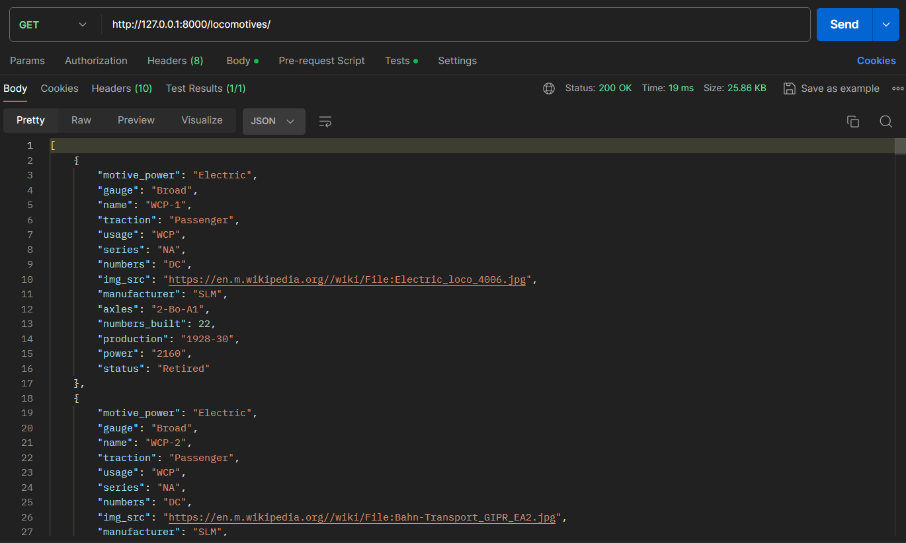
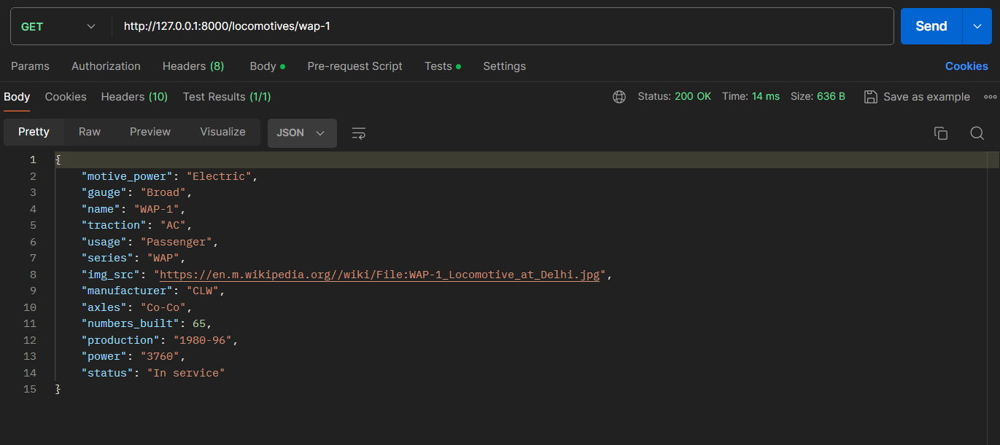

# LocomotiveDataAPI

LocomotiveDataAPI is a RESTful Web Service made in Django REST framework which aims to provide information Indian locomotives (Indian Railways) scraped from Wikipedia using Beautiful Soup.

## Run Locally

Clone the project

```bash
  git clone https://github.com/cyberpsychofc/LocomotiveDataAPI
```

Go to the project directory

Install dependencies

```bash
  pip install beautifulsoup4
  pip install requests
  pip install Django
  pip install djangorestframework
  pip install pyjwt
  pip install django-cors-headers
```

Start the server

```bash
  python manage.py runserver
```
## Updating the Database

Update the database before making an API call.

```bash
  python manage.py updatemodels
```

## Register a User
Create a superuser via CI. 
```bash
  python manage.py createsuperuser
```
Register your standard users using Postman

```http
  POST /api/register
```
Pass the following parameters

| Parameter | Type     | Description                |
| :-------- | :------- | :------------------------- |
| `name` | `string` | `${name}` |
| `email` | `string` | `${email}` |
| `password` | `string` | `${passwrd}` |

## Via Postman
### Logging in

```http
  POST /api/login
```
Pass the following parameters

| Parameter | Type     | Description                |
| :-------- | :------- | :------------------------- |
| `email` | `string` | `${email}` |
| `password` | `string` | `${passwrd}` |
### Status
To check if you're logged in
```http
  GET /api/user
```
If you're logged in you will see your user details in the response

### Logout
```http
  POST /api/logout
```
    
## Demo

Endpoint demonstration of the API. For more information refer to the documentaiton.

https://localhost:8000/locomotives



Lets search for a particular locomotive e.g. WAP-1

https://localhost:8000/locomotives/wap-1




## API Reference

#### Get list of all locomotives

```http
  GET /api/locomotives/
```

| Parameter | Type     | Description                |
| :-------- | :------- | :------------------------- |
| `locomotives` | `string` | **Required**. Returns entire list of locomotives |

#### Get a particular locomotive

```http
  GET /api/locomotives/${name}
```

| Parameter | Type     | Description                       |
| :-------- | :------- | :-------------------------------- |
| `name`      | `string` | **Required**. Returns the details of a particular locomotive |

#### Get a list of Electric locomotives

```http
  GET /api/locomotives/electric
```

| Parameter | Type     | Description                       |
| :-------- | :------- | :-------------------------------- |
| `electric`      | `string` | **Required**. Returns entire list of electric locomotives |

#### Get a list of Diesel locomotives
```http
  GET /api/locomotives/diesel
```
| Parameter | Type     | Description                       |
| :-------- | :------- | :-------------------------------- |
| `diesel`      | `string` | **Required**. Returns entire list of diesel locomotives |

#### Get a list of Broad-Gauge locomotives

```http
  GET /api/locomotives/broad
```

| Parameter | Type     | Description                       |
| :-------- | :------- | :-------------------------------- |
| `broad`      | `string` | **Required**. Returns entire list of broad-gauge locomotives |
#### Get a list of Meter-Gauge locomotives

```http
  GET /api/locomotives/meter
```

| Parameter | Type     | Description                       |
| :-------- | :------- | :-------------------------------- |
| `meter`      | `string` | **Required**. Returns entire list of meter-gauge locomotives |

#### Get a list of Narrow-Gauge locomotives

```http
  GET /api/locomotives/narrow
```

| Parameter | Type     | Description                       |
| :-------- | :------- | :-------------------------------- |
| `narrow`      | `string` | **Required**. Returns entire list of narrow-gauge locomotives |

#### Get a list of Narrower-Gauge locomotives

```http
  GET /api/locomotives/narrower
```

| Parameter | Type     | Description                       |
| :-------- | :------- | :-------------------------------- |
| `narrower`      | `string` | **Required**. Returns entire list of narrower-gauge locomotives |


## Authors

- [@cyberpsychofc](https://www.github.com/cyberpsychofc)